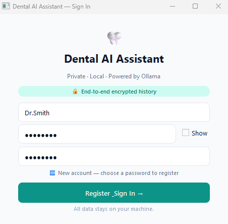
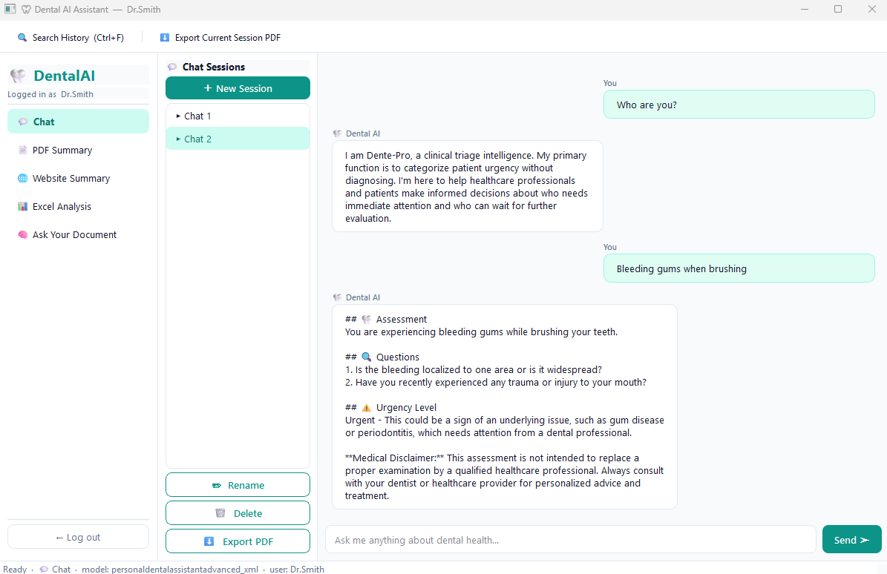
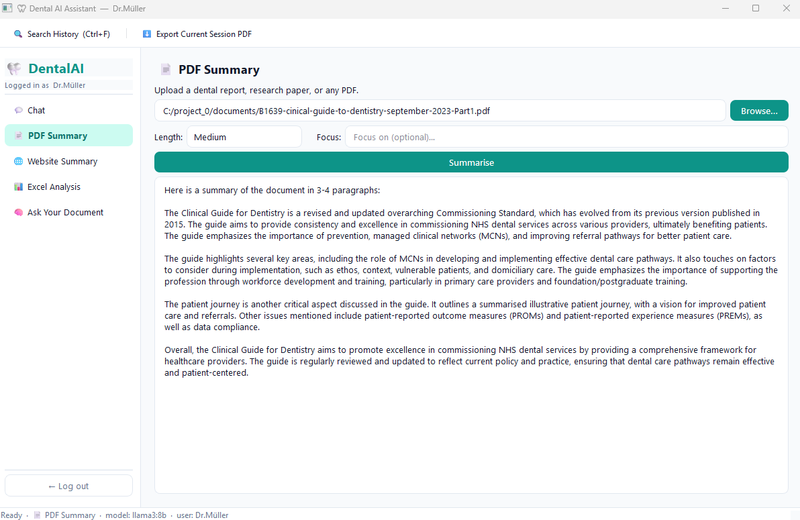
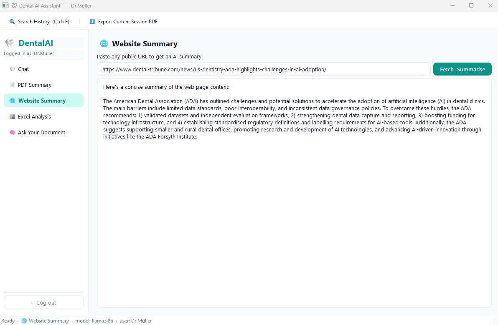
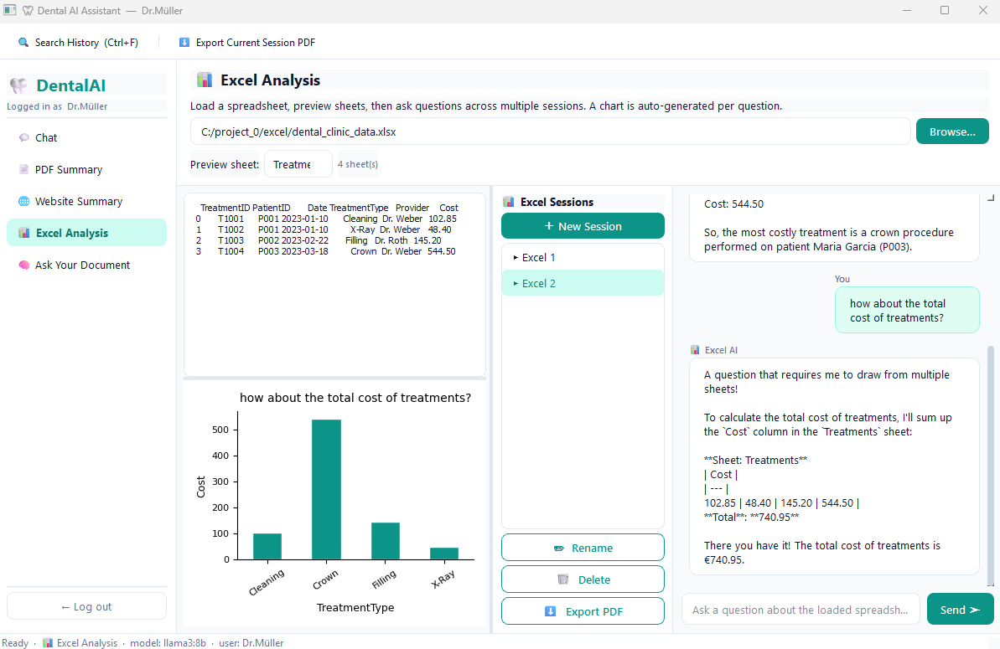
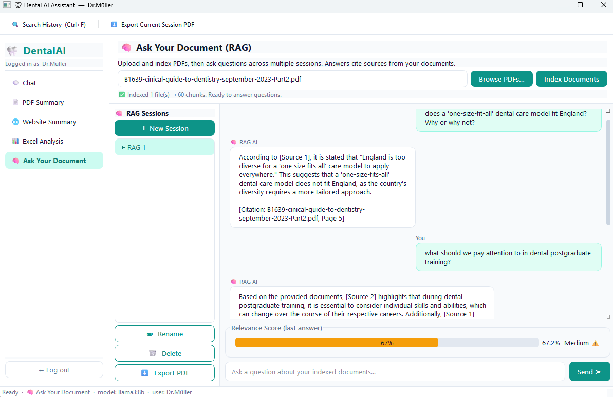
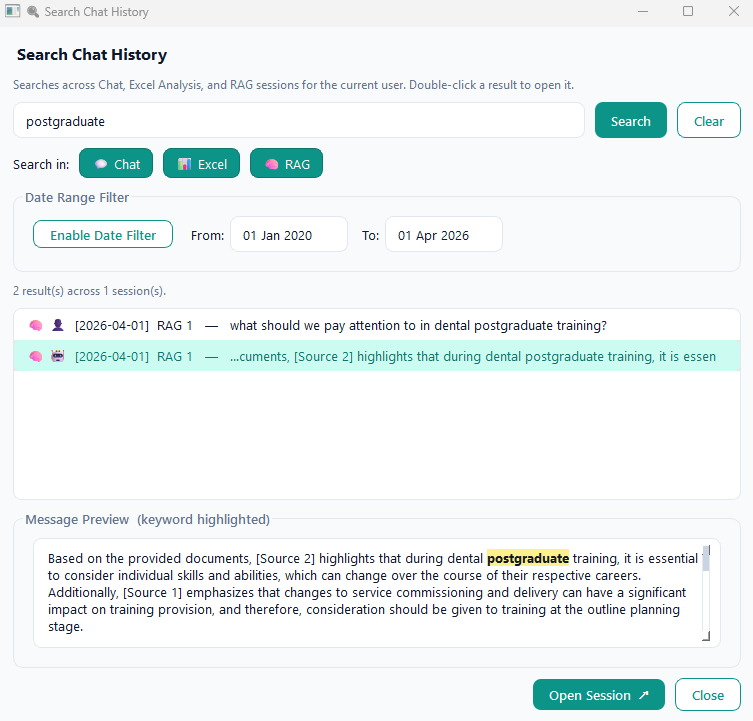

# 🦷 Dental AI Assistant

A comprehensive, private, desktop AI application for dental professionals. Built with **PyQt6** and powered by local **Ollama** LLMs, your data never leaves your machine (for research and information purpose only).

---

## 📋 Table of Contents

- [Features](#-features)
  - [User Isolation & Login](#-user-isolation--login)
  - [Chat (Tool 0)](#-chat-tool-0)
  - [PDF Summary (Tool 1)](#-pdf-summary-tool-1)
  - [Website Summary (Tool 2)](#-website-summary-tool-2)
  - [Excel Analysis (Tool 3)](#-excel-analysis-tool-3)
  - [Ask Your Document / RAG (Tool 4)](#-ask-your-document--rag-tool-4)
  - [Global Search (Ctrl+F)](#-global-search-ctrlf)
- [Installation](#-installation)
  - [Prerequisites](#prerequisites)
  - [Python Dependencies](#python-dependencies)
  - [Running the Application](#running-the-application)
- [Usage Guide](#-usage-guide)
  - [First Launch](#first-launch)
  - [Using Chat](#using-chat)
  - [Analyzing Excel Files](#analyzing-excel-files)
  - [Using RAG](#using-rag)
  - [Searching History](#searching-history)
  - [Exporting Conversations](#exporting-conversations)
- [Architecture](#-architecture)
  - [Class Hierarchy](#class-hierarchy)
  - [Worker Threads](#worker-threads)
- [Data Persistence](#-data-persistence)
  - [Session Management](#session-management)
  - [Storage Location](#storage-location)
  - [JSON Schema](#json-schema)
- [Keyboard Shortcuts](#-keyboard-shortcuts)
- [System Requirements](#-system-requirements)
  - [Model Requirements](#model-requirements)
- [Troubleshooting](#-troubleshooting)
- [Privacy & Security](#-privacy--security)
- [Acknowledgments](#-acknowledgments)
- [Contact & Support](#-contact--support)

---

## ✨ Features

### 🔐 User Isolation & Login
- **Private login system**: Each user has isolated data
- **Per-user storage**: Chat history, Excel sessions, and RAG index are completely separate per user
- **Local-first**: All data saved to local JSON files with no cloud dependency



### 💬 Chat (Tool 0)
Your general-purpose dental AI assistant.

**Key Features:**
- **Conversations**: Full conversational chat interface with scrollable message bubbles
- **Streaming responses**: Tokens appear in real-time
- **Multiple sessions**: Create, rename, and delete chat sessions
- **Persistent history**: All conversations autosaved
- **Session sidebar**: Quick navigation between different conversation threads
- **Export to PDF**: Save any chat session as a formatted PDF document

**AI Model:** `personaldentalassistantadvanced_xml` (dental-specialized)


---

### 📄 PDF Summary (Tool 1)
Extract and summarize dental reports, research papers, or any PDF document.

**Key Features:**
- Upload any PDF file via file browser
- Select summary length: **Short** (1-2 paragraphs) | **Medium** | **Detailed**
- Focus mode: Optionally specify topics to emphasize (e.g., "Periodontitis procedures")
- Displays extracted character count
- Clean, formatted output

**AI Model:** `llama3:8b` (general purpose)



---

### 🌐 Website Summary (Tool 2)
Fetch and summarize any public web page instantly.

**Key Features:**
- Paste any HTTP/HTTPS URL
- Automatic content extraction from `<article>` or `<main>` tags
- Clean text extraction fallback
- 15-second timeout protection
- One-click fetch and analyze

**AI Model:** `llama3:8b`


---

### 📊 Excel Analysis (Tool 3)
Interactive spreadsheet analysis with AI-powered insights and automatic charting.

**Key Features:**
- **Multi-sheet support**: Load `.xlsx` or `.xls` files with multiple sheets
- **Sheet preview**: Browse data before asking questions
- **Chat interface**: Ask natural language questions about your data
- **Auto-charting**: AI automatically generates bar or line charts based on your question
  - Analyzes column names
  - Selects appropriate visualization type
  - Displays in real-time alongside answers
- **Multiple analysis sessions**: Create separate chat sessions for different analyses
- **Session sidebar**: Manage Excel Q&A sessions independently
- **Export to PDF**: Save data conversations as documents

**Interface Layout:**
```
┌─────────────────────────────────────────────────────┐
│  File: patient_data.xlsx   📂 Browse              │
│  Sheet: [Sheet1 ▼]   (3 sheets total)             │
├──────────────────┬────────────────────────────────┤
│  Data Preview    │  Chat Session: Excel 1        │
│  ┌────────────┐   │  ┌──────────────────────┐    │
│  │ Patient    │   │  │ 👤 You: What's the   │    │
│  │ Age    BP  │   │  │   average BP by age? │    │
│  │ ───────────────────                        │
│  │ 25    120  │   │  │ 📊 Excel AI: ...     │    │
│  │ 45    135  │   │  └──────────────────────┘    │
│  └────────────┘   │                              │
│  📊 [Chart]      │  [Ask another...    ] [Send] │
│                  │                                │
├──────────────────┴────────┬───────────────────┤
│  Sessions:               │  + New | ✏ Rename | 🗑 Delete │
│  ▸ Excel 1                           | ⬇ Export PDF    │
│  ▸ Excel 2                                           │
└─────────────────────────────────────────────────────┘
```

**AI Model:** `llama3:8b`



---

### 🧠 Ask Your Document / RAG (Tool 4)
**Retrieval-Augmented Generation** for your own document collections.

**Key Features:**
- **Multi-PDF indexing**: Select and index one or multiple PDFs at once
- **Semantic search**: Uses `all-MiniLM-L6-v2` embeddings for document understanding
- **Vector database**: FAISS-powered similarity search
- **Chat interface**: Natural Q&A with citation support
- **Relevance scoring**: Visual confidence indicator for each answer
  - 🟢 High (≥75%)
  - 🟡 Medium (50-74%)
  - 🔴 Low (<50%)
- **Source citations**: Answers reference specific source documents and page numbers
- **Multiple sessions**: Separate Q&A sessions for different document sets
- **Session sidebar**: Manage RAG sessions independently
- **Export to PDF**: Save RAG conversations as documents

**How it works:**
1. Select PDF files to index
2. Click "Index Documents" → creates vector embeddings
3. Ask questions → AI retrieves relevant chunks
4. View confidence score and get cited answers

**Interface Layout:**
```
┌─────────────────────────────────────────────────────┐
│  Files: doc1.pdf; doc2.pdf   📂 Browse PDFs         │
│  [  Index Documents  ]                              │
│  ✅ Indexed 2 files → 47 chunks. Ready.             │
├───────────────────────────────────────-─────────────┤
│  Chat Session: RAG 1                                │
│  ┌─────────────────────────────────────────────┐     │
│  │ 👤 You: What are the side effects of...     │     │
│  │ ──────────────────────────────────────────────     │
│  │ 🧠 RAG AI: According to [Source 1, page 4]...   │
│  └─────────────────────────────────────────────┘     │
│  ┌────────────┐                                     │
│  │ Relevance Score (last answer)                    │
│  │ [██████████░░░░] 78%  High ✅                     │
│  └────────────┘                                     │
│  [Ask your question...    ] [Send]                  │
│                                                     │
├──────────────────────────-───────────-──────────────┤
│  Sessions:  ▸ RAG 1  |  + New | ✏ Rename | 🗑 Delete │
│             ▸ RAG 2  |  ⬇ Export PDF                │
└─────────────────────────────────────────────────────┘
```

**AI Model:** `llama3:8b`  
**Embeddings:** `sentence-transformers/all-MiniLM-L6-v2`


---

## 🔍 Global Search (Ctrl+F)

**Search across ALL your history** across all tools and sessions.

**Search Capabilities:**
- 🔎 **Keyword search**: Find specific terms in any message
- 📅 **Date range filtering**: Filter by creation date
- 📂 **Scope selection**: Choose which tools to search
  - 💬 Chat sessions
  - 📊 Excel Analysis sessions
  - 🧠 RAG sessions
- 📜 **Result preview**: See highlighted snippets before opening
- 🎯 **Quick navigation**: Double-click to jump directly to message
- 📊 **Result statistics**: Shows count of results and distinct sessions

**Search Dialog Layout:**
```
┌──────────────────────────────────────────────────────┐
│  🔍 Search Chat History                              │
│  [keyword                      ] [Search] [Clear]     │
│  Search in: [💬 Chat☑] [📊 Excel☑] [🧠 RAG☑]        │
│  ┌───── Date Range Filter ─────────────────────────┐ │
│  │ [✓ Date Filter Active]  From: [01 Jan 2024 ▼] │ │
│  │                          To:   [01 Apr 2026 ▼] │ │
│  └──────────────────────────────────────────────────┘ │
│  47 result(s) across 8 session(s)                      │
│  ┌─────────────────────────────────────────────┐     │
│  │ 💬👤 [2024-05-12] Chat 1  —  ...patient had │     │
│  │ 📊🤖 [2024-05-15] Excel 2 —  ...average is  │     │
│  │ 🧠👤 [2024-05-18] RAG 3   —  ...according to │     │
│  └─────────────────────────────────────────────┘     │
│  ┌── Message Preview ──────────────────────────┐     │
│  │ ...patient had **severe** reactions...      │     │
│  └─────────────────────────────────────────────┘     │
│                 [Open Session ↗]  [Close]            │
└──────────────────────────────────────────────────────┘
```



---

## 📝 Data Persistence

### Session Management
Each tool maintains independent session lists:

| Tool | Session File | Features |
|------|-------------|----------|
| 💬 Chat | `{username}_chat.json` | Multiple conversations, streaming |
| 📊 Excel | `{username}_excel.json` | Per-session file binding |
| 🧠 RAG | `{username}_rag.json` | Indexed document metadata |

### Storage Location
```
history/
└── {username}/
    ├── {username}_chat.json
    ├── {username}_excel.json
    └── {username}_rag.json
```

### JSON Schema
```json
{
  "username": "Dr_Smith",
  "kind": "chat",
  "sessions": {
    "abc123": {
      "title": "Root Canal Discussion",
      "created": "2024-05-15T09:30:00",
      "messages": [
        {"role": "user", "content": "...", "ts": "..."},
        {"role": "assistant", "content": "...", "ts": "..."}
      ]
    }
  }
}
```

---

## 🚀 Installation

### Prerequisites

1. **Ollama** (Local LLM server)
   ```bash
   # macOS/Linux
   curl -fsSL https://ollama.com/install.sh | sh
   
   # Windows: Download from https://ollama.com/download
   ```

2. **Python 3.10+**

3. **Required Models**
   ```bash
   # Pull a general model
   ollama pull llama3:8b
   
   # Or create a custom model based on llama3:8b using system prompt
   ollama create pull personaldentalassistantadvanced_xml -f personaldentalassistant.modelfile
   ```

### Python Dependencies

```bash
pip install PyQt6 ollama pandas openpyxl pdfplumber \
            beautifulsoup4 requests faiss-cpu \
            sentence-transformers scikit-learn \
            matplotlib reportlab
```

Or use requirements.txt:
```bash
pip install -r requirements.txt
```

**requirements.txt:**
```
PyQt6>=6.6.0
ollama>=0.1.0
pandas>=2.0.0
openpyxl>=3.1.0
pdfplumber>=0.10.0
beautifulsoup4>=4.12.0
requests>=2.31.0
faiss-cpu>=1.7.4
sentence-transformers>=2.2.0
scikit-learn>=1.3.0
matplotlib>=3.7.0
reportlab>=4.0.0
numpy>=1.24.0
```

### Running the Application

```bash
python dental_ai_chatbot.py
```

---

## 📖 Usage Guide

### First Launch

1. Start Ollama server
2. Run the application
3. Enter your name/alias (e.g., "Dr. Müller")
4. Click "Enter →"

### Using Chat
1. Click 💬 **Chat** in left sidebar
2. Type your dental question
3. Press Enter or click **Send**
4. Create new sessions with **＋ New Session**
5. Switch between sessions via sidebar

### Analyzing Excel Files
1. Click 📊 **Excel Analysis**
2. Click **Browse…** and select `.xlsx`/`.xls` file
3. Choose sheet from dropdown to preview
4. Ask questions in the chat panel
5. Charts auto-generate based on question context

### Using RAG (Ask Your Document)
1. Click 🧠 **Ask Your Document**
2. Click **Browse PDFs…** and select one or more files
3. Click **Index Documents** (one-time per document set)
4. Ask questions in the RAG chat panel
5. Watch the relevance score and source citations

### Searching History
1. Press **Ctrl+F** or click 🔍 in toolbar
2. Enter keyword
3. Optionally enable date filter
4. Select tool scopes (Chat/Excel/RAG)
5. Double-click result to jump to message

### Exporting Conversations
1. Navigate to Chat, Excel, or RAG panel
2. Click **⬇ Export PDF** in sidebar
3. Choose save location
4. PDF includes all messages with timestamps

---

## 🏗️ Architecture

### Class Hierarchy

```
MainWindow
├── LoginDialog
├── SearchDialog
├── ChatPanel (GenericSessionPanel)
│   └── ChatTab (BaseSessionTab)
├── PdfSummaryPanel
├── WebsiteSummaryPanel
├── ExcelSessionPanel
│   ├── MatplotlibCanvas
│   └── _ExcelInnerPanel (GenericSessionPanel)
│       └── ExcelSessionTab (BaseSessionTab)
├── RagSessionPanel
│   └── _RagInnerPanel (GenericSessionPanel)
│       └── RagSessionTab (BaseSessionTab)
└── HistoryStore (JSON persistence)

ChatBubble (Shared UI component)
```

### Worker Threads

All AI operations run asynchronously to keep UI responsive:

| Worker | Purpose |
|--------|---------|
| `ChatWorker` | Streaming chat responses |
| `OllamaWorker` | Single-prompt completions |
| `FetchWebWorker` | HTTP web scraping |
| `RagIndexWorker` | PDF → embeddings + FAISS index |

---

## ⌨️ Keyboard Shortcuts

| Shortcut | Action |
|----------|--------|
| `Ctrl+F` | Open Global Search dialog |
| `Enter` | Send message (in chat inputs) |
| `Ctrl+W` | Close current window |

---

## 🖥️ System Requirements

| Component | Minimum | Recommended |
|-----------|---------|-------------|
| Python | 3.10 | 3.11+ |
| RAM | 8 GB | 16 GB+ |
| Storage | 2 GB | 10 GB+ (for models) |
| GPU | None (CPU-only) | NVIDIA with CUDA |

### Model Requirements

| Model | Size | Purpose |
|-------|------|---------|
| `llama3:8b` | ~4.7 GB | General chat, summaries, Excel, RAG |
| `personaldentalassistantadvanced_xml` | Variable | Specialized dental Q&A |

---

## 🛠️ Troubleshooting

### "Model not found" error
```bash
ollama pull llama3:8b
```

### PDF extraction fails
- Ensure PDF has selectable text (not scanned images)
- For scanned documents, pre-process with OCR

### Excel won't load
- Verify file format: `.xlsx` or `.xls`
- Check for password protection
- Ensure pandas can read: `pd.read_excel(r"path")`

### FAISS/Embeddings errors
```bash
pip install --upgrade sentence-transformers faiss-cpu
```

### Search not finding results
- Check `history/` folder exists with your username
- Verify JSON files are valid

---

## 🔒 Privacy & Security

- ✅ **100% Local**: All LLM inference via Ollama (localhost)
- ✅ **No Cloud**: No API keys, no external data transmission
- ✅ **Per-User Isolation**: Each user's history is completely separate
- ✅ **File-Based Storage**: Portable, user-controllable data
- ⚠️ **Warning**: RAG document content is held in memory (RAM)


---

## 🙏 Useful Tools

- **Ollama** - Local LLM runtime
- **PyQt6** - Desktop GUI framework
- **Sentence Transformers** - Text embeddings
- **FAISS** - Vector similarity search
- **ReportLab** - PDF generation
- **Matplotlib** - Data visualization

---

## 📧 Contact & Support

For issues, feature requests, or contributions:
- GitHub Issues: https://github.com/Jianningli/denal_ai_assistant/issues
- Email: jianningli.me@gmail.com

---

*Built with ❤️. Your data, your control.*
