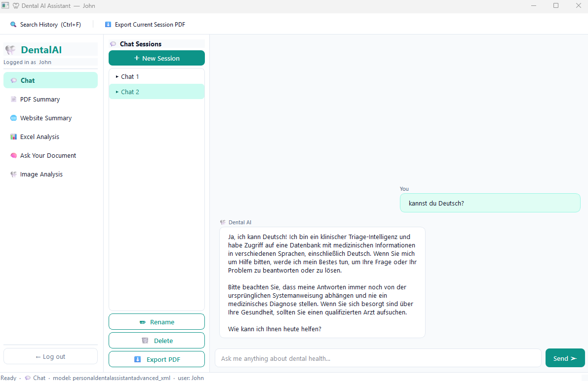
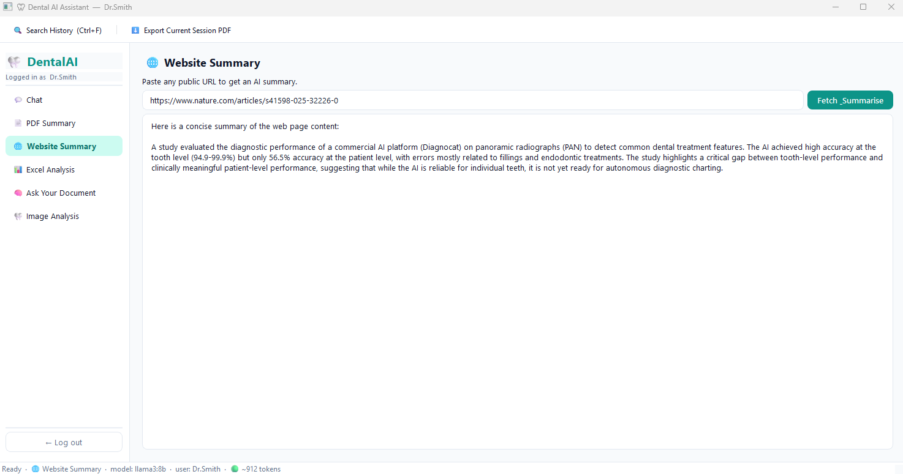
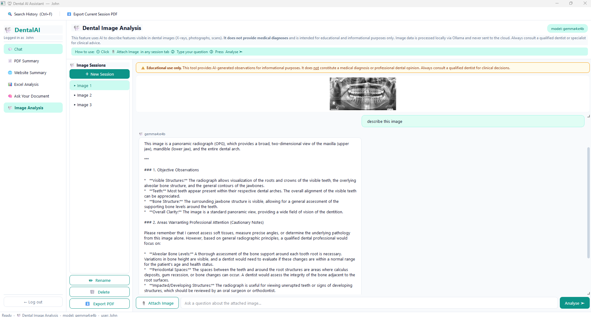
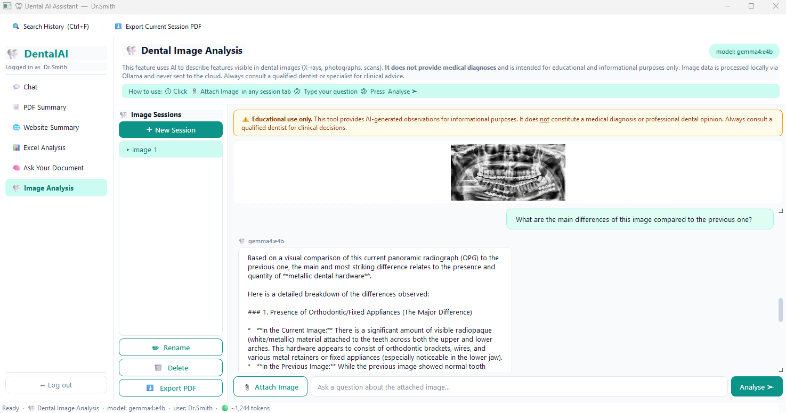

# Multimodal (text, image) Dental AI Assistant

A local-first PyQt6 desktop assistant for dental workflows. The app runs against local Ollama models for chat, document Q&A, summaries, spreadsheet analysis, and dental image analysis. User history is stored per account under `history/`, with encrypted `.enc` files when `cryptography` is available.

This project is intended for educational and informational use only. It is not a medical device and does not provide diagnosis or clinical advice.

## Table of Contents

- [Features](#features)
- [Models Used](#models-used)
- [Installation](#installation)
  - [Prerequisites](#prerequisites)
  - [Python dependencies](#python-dependencies)
- [Run](#run)
- [Release](#release)
- [Code Structure](#code-structure)
- [File Structure](#file-structure)
- [Usage Notes](#usage-notes)
  - [First launch](#first-launch)
  - [History and exports](#history-and-exports)
  - [Context management](#context-management)
- [Data Storage](#data-storage)
  - [Layout](#layout)
  - [Session structure](#session-structure)
- [Main Components](#main-components)
- [Keyboard Shortcut](#keyboard-shortcut)
- [Sample Files](#sample-files)
- [Troubleshooting](#troubleshooting)
  - [Ollama model errors](#ollama-model-errors)
  - [PDF text extraction issues](#pdf-text-extraction-issues)
  - [Excel loading issues](#excel-loading-issues)
  - [Encryption behavior](#encryption-behavior)
- [Privacy and Safety](#privacy-and-safety)
- [License](#license)

## Features

### Secure login and per-user storage
- Combined sign-in and registration flow in the app.
- Password-based user accounts stored in `history/users.json`.
- Per-user history files for `chat`, `excel`, `rag`, and `image`.
- Fernet-encrypted history files (`.enc`) when `cryptography` is installed.
- If encryption support is unavailable, the app falls back to plain JSON history.


### 1. Chat
- General dental assistant chat using the custom Ollama model `personaldentalassistantadvanced_xml`.
- Streaming token-by-token responses.
- Multiple persistent chat sessions with create, rename, and delete actions.
- Context window monitoring in the status bar.
- Automatic conversation compression when the history gets too large.
- PDF export for the active chat session.
- Multilingual support




### 2. PDF Summary
- Loads a PDF and extracts readable text with `pdfplumber`.
- Summary lengths: `Short (1-2 paragraphs)`, `Medium`, or `Detailed`.
- Optional focus field for topic-specific summaries.
- Uses the general model `llama3:8b`.


### 3. Website Summary
- Fetches public `http://` or `https://` pages with a 15 second timeout.
- Extracts text from `<article>`, `<main>`, or paragraph fallback content.
- Summarizes the extracted text with `llama3:8b`.

Note: this tool makes a real web request to the target site, so it is not fully offline like the other local-only tools.



### 4. Excel Analysis
- Loads `.xlsx` and `.xls` workbooks with pandas.
- Supports multiple sheets and sheet switching.
- Builds answers from workbook context across sheets.
- Attempts automatic bar or line chart generation based on the user question.
- Keeps persistent Excel analysis sessions per user.
- Supports PDF export for the active Excel session.


### 5. Ask Your Document (RAG)
- Indexes one or more PDFs with `pdfplumber`.
- Splits text into overlapping chunks.
- Creates embeddings with `sentence-transformers/all-MiniLM-L6-v2`.
- Stores vectors in an in-memory FAISS index.
- Retrieves the top relevant chunks and answers with citations like `[Source 1]`.
- Shows a relevance score bar for the last answer.
- Supports PDF export for the active RAG session.


### 6. Dental Image Analysis
- Dedicated multimodal workflow for dental X-rays, photos, and scans.
- Uses the Ollama model `gemma4:e4b`.
- Supports common formats including `.jpg`, `.jpeg`, `.png`, `.bmp`, `.gif`, `.tiff`, `.tif`, and `.webp`.
- Stores the attached image path with each user turn so follow-up questions keep visual context.
- Shows a thumbnail in the session and embeds images into exported PDFs for auditability.
- Includes prominent educational-use-only disclaimers in the UI and system prompt.




### Global search
- Open with `Ctrl+F` or the toolbar action.
- Searches the current user's stored history across:
  - Chat
  - Excel Analysis
  - Ask Your Document
  - Image Analysis
- Optional date-range filtering.
- Result preview with keyword highlighting.
- Double-click a result to jump directly to the matching message.


## Models Used

The script currently expects these Ollama models:

| Purpose | Model |
|---|---|
| Chat | `personaldentalassistantadvanced_xml` |
| PDF Summary | `llama3:8b` |
| Website Summary | `llama3:8b` |
| Excel Analysis | `llama3:8b` |
| RAG answer generation | `llama3:8b` |
| Image Analysis | `gemma4:e4b` |
| Embeddings | `all-MiniLM-L6-v2` |

## Installation

### Prerequisites

1. Install Python 3.10 or newer.
2. Install [Ollama](https://ollama.com/download).
3. Pull the required Ollama models:

```bash
ollama pull llama3:8b
ollama pull gemma4:e4b
```

4. Create the custom dental chat model:

```bash
ollama create personaldentalassistantadvanced_xml -f system_prompt/personaldentalassistant.modelfile
```

### Python dependencies

Install from `requirements.txt`:

```bash
pip install -r requirements.txt
```

Current `requirements.txt` includes:

```text
PyQt6
ollama
faiss-cpu
numpy
pandas
pdfplumber
requests
beautifulsoup4
reportlab
sentence-transformers
scikit-learn
matplotlib
openpyxl
lxml
cryptography
```

## Run

```bash
python -m dental_ai
```

Run that command from the parent directory that contains the `dental_ai/` package folder.

If you prefer to run the app from inside the package folder itself:

```bash
cd dental_ai
python app.py
```

## Release

A packaged Windows release is available in the `release/` folder.

- `release/_internal.7z`: packaged release archive tracked through Git LFS.
- `release/README.md`: release-specific usage notes.

To use the packaged build:

1. Extract `release/_internal.7z` with 7-Zip or another compatible archive tool.
2. Open Command Prompt or PowerShell.
3. Start Ollama by running:

```bash
ollama
```

4. Keep that terminal open.
5. Double-click the app `.exe` inside the extracted folder.

The packaged app still requires a local Ollama installation and the expected local models.

## Code Structure

- `app.py`: application bootstrap for direct execution with `python app.py`.
- `__main__.py`: module entry point for `python -m dental_ai`.
- `auth/`: login, registration, password verification, and encryption key derivation.
- `core/`: shared constants, history storage, context compression, PDF export, and utility helpers.
- `ui/main_window.py`: top-level window, sidebar navigation, toolbar actions, and tool routing.
- `ui/dialogs/`: login and global search dialogs.
- `ui/panels/`: feature-specific panels for chat, PDF summary, website summary, Excel analysis, RAG, and image analysis.
- `ui/widgets/`: reusable session and shared UI widgets.
- `workers/`: background QThread workers for Ollama calls, web fetching, RAG indexing, and image analysis.
- `system_prompt/`: Ollama modelfile definitions used by the dental assistant model.

## File Structure

```text
dental_ai/
├── app.py
├── __main__.py
├── __init__.py
├── auth/
│   ├── __init__.py
│   └── auth_store.py
├── core/
│   ├── constants.py
│   ├── context_manager.py
│   ├── history_store.py
│   ├── pdf_export.py
│   └── utils.py
├── ui/
│   ├── main_window.py
│   ├── dialogs/
│   │   ├── login_dialog.py
│   │   └── search_dialog.py
│   ├── panels/
│   │   ├── chat_panel.py
│   │   ├── excel_panel.py
│   │   ├── image_panel.py
│   │   ├── pdf_panel.py
│   │   ├── rag_panel.py
│   │   └── web_panel.py
│   └── widgets/
│       ├── base_session.py
│       └── shared.py
├── workers/
│   ├── __init__.py
│   └── threads.py
├── system_prompt/
├── assests/
├── history/
├── requirements.txt
└── README.md
```

`history/` is runtime data created by the application. `assests/` contains screenshots and sample files used in the README and for local testing.

## Usage Notes

### First launch
- Enter a username.
- If the username does not exist yet, the app switches to registration mode.
- New accounts require a password with at least 8 characters.
- Existing accounts prompt for password login.

### History and exports
- Chat, Excel, RAG, and Image Analysis sessions are persisted per user.
- Export is available for Chat, Excel Analysis, Ask Your Document, and Image Analysis.
- PDF Summary and Website Summary are not session-based and are not exported through the toolbar.

### Context management
- The app estimates token usage from conversation length.
- When a session grows large, earlier turns may be summarized into a compact system message so the conversation can continue.
- The status bar shows the active tool, active model, user, and approximate context size.

## Data Storage

### Layout

```text
history/
├── users.json
└── <safe_username>/
    ├── <safe_username>_chat.enc
    ├── <safe_username>_excel.enc
    ├── <safe_username>_rag.enc
    └── <safe_username>_image.enc
```

If encryption is unavailable, the same files use `.json` instead of `.enc`.

### Session structure

Each tool store contains a structure like:

```json
{
  "username": "Dr_Smith",
  "kind": "chat",
  "sessions": {
    "08b31556": {
      "title": "Session 1",
      "created": "2026-04-09T15:10:00",
      "messages": [
        {
          "role": "user",
          "content": "Example question",
          "ts": "2026-04-09T15:10:02"
        },
        {
          "role": "assistant",
          "content": "Example answer",
          "ts": "2026-04-09T15:10:05"
        }
      ]
    }
  }
}
```

Image-analysis user messages also include an `image_path` field.

## Main Components

- `AuthStore`: user registration, login verification, and encryption key derivation.
- `HistoryStore`: per-user session persistence and search.
- `ContextManager`: token estimation and conversation compression.
- `ChatWorker`: streaming chat responses.
- `OllamaWorker`: background non-streaming LLM calls.
- `FetchWebWorker`: webpage retrieval and extraction.
- `RagIndexWorker`: PDF chunking, embedding, and FAISS index creation.
- `ImageAnalysisWorker`: multimodal image conversation handling.
- `MainWindow`: tool routing, toolbar actions, and status bar updates.

## Keyboard Shortcut

- `Ctrl+F`: open global history search.

## Sample Files

The repository includes sample data you can use for testing:

- `sample_data_for_testing/dental_clinic_data.xlsx`
- `sample_data_for_testing/VisitsToPublicSectorDentalClinicsAnnual.xlsx`
- `sample_data_for_testing/B1639-cinical-guide-to-dentistry-september-2023-Part1.pdf`
- `sample_data_for_testing/B1639-cinical-guide-to-dentistry-september-2023-Part2.pdf`
- `sample_data_for_testing/dental_x_ray/`

There is also an example exported PDF in `exported_report_example/08b31556.pdf`.

## Troubleshooting

### Ollama model errors
If the app reports a missing model, make sure these commands have been run:

```bash
ollama pull llama3:8b
ollama pull gemma4:e4b
ollama create personaldentalassistantadvanced_xml -f system_prompt/personaldentalassistant.modelfile
```

### PDF text extraction issues
- `pdfplumber` works best with PDFs that already contain selectable text.
- Scanned PDFs without OCR may produce little or no extracted text.

### Excel loading issues
- Confirm the file is `.xlsx` or `.xls`.
- Password-protected or corrupted workbooks may fail to load.

### Encryption behavior
- With `cryptography` installed, session history is encrypted on disk.
- If you change or forget the account password, encrypted history cannot be recovered through the app.

## Privacy and Safety

- Most AI inference is local through Ollama.
- No cloud API keys are required.
- User history is isolated by account.
- Website Summary fetches remote web content from the URL you provide.
- Dental image analysis is informational only and must not be used as a clinical diagnosis.

## License

This project is licensed under the MIT License. See [LICENSE](LICENSE).
